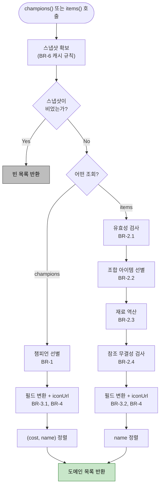

# U1 Business Logic Model

처리 흐름과 알고리즘. 기술 중립적으로 기술한다.

---

## 1. 전체 처리 흐름



### Text Alternative

```
champions()/items() 호출
  → 스냅샷 확보 (메모리 → 디스크 → 원격)
  → 스냅샷이 비었으면 빈 목록 반환 (종료)
  → champions 경로: 선별(BR-1) → 변환(BR-3.1, BR-4) → (cost,name) 정렬
  → items 경로:    유효성(BR-2.1) → 조합 선별(BR-2.2) → 재료 역산(BR-2.3)
                   → 무결성 검사(BR-2.4) → 변환(BR-3.2, BR-4) → name 정렬
  → 도메인 목록 반환
```

---

## 2. 알고리즘 — 스냅샷 확보 (BR-6)

```
FUNCTION 스냅샷_확보():
    IF 메모리캐시 존재:
        RETURN 메모리캐시

    IF 디스크캐시 파일 존재:
        TRY:
            데이터 ← 파일 읽기
            IF 현재시각 - 데이터.fetchedAt < 24시간:
                메모리캐시 ← 데이터
                RETURN 데이터
        CATCH 손상/읽기실패:
            무시하고 계속 진행

    TRY:
        원본 ← HTTP GET (CDragon 전체 JSON, 약 25MB)
        추출본 ← 필요필드_추출(원본)          # 25MB → 수백 KB
        TRY: 디스크에 추출본 저장
        CATCH: 무시 (BR-6.4)
        메모리캐시 ← 추출본
        RETURN 추출본
    CATCH 네트워크/파싱 실패:
        RETURN 빈스냅샷                        # BR-7
```

### 필요필드_추출

```
FUNCTION 필요필드_추출(원본):
    세트 ← 환경변수 TFT_SET, 없으면 "17"      # BR-5
    세트데이터 ← 원본.sets[세트]
    IF 세트데이터 없음:
        RETURN 빈스냅샷                        # BR-5 규칙 3

    RETURN {
        setNumber:  세트,
        champions:  세트데이터.champions,
        traits:     세트데이터.traits,          # 현재 미사용, 확장 대비
        items:      원본.items,                 # 아이템은 세트 구분 없이 전역
        fetchedAt:  현재시각
    }
```

> **아이템이 전역인 이유**: CDragon 은 아이템을 세트별로 나누지 않고 단일 배열로 제공한다.
> 세트 구분은 `apiName` 접두사로 이루어지며, BR-2.2 가 이를 처리한다.

---

## 3. 알고리즘 — 챔피언 조회 (BR-1)

```
FUNCTION 챔피언_목록():
    스냅샷 ← 스냅샷_확보()
    결과 ← []

    FOR EACH 원본 IN 스냅샷.champions:
        # BR-1.1 선별
        IF 원본.traits 가 비었거나 없음:      CONTINUE   # PVE·소환수
        IF 원본.cost 가 1~5 범위 밖:          CONTINUE
        IF 원본.name 이 없거나 빈 문자열:      CONTINUE

        # BR-3.1 변환
        결과.추가({
            id:      원본.apiName,
            name:    원본.name,
            cost:    정수(원본.cost),
            traits:  원본.traits,              # 이미 한글, 변환 없음
            iconUrl: 에셋URL(원본.tileIcon)     # squareIcon 아님 (BR-3.1 주의)
        })

    RETURN 정렬(결과, key=(cost, name))         # BR-1.3
```

**예상 출력**: 약 63개

---

## 4. 알고리즘 — 아이템 조회 (BR-2)

아이템은 **2패스**가 필요하다. 기본 재료를 조합 아이템에서 역산하기 때문이다.

```
FUNCTION 아이템_목록():
    스냅샷 ← 스냅샷_확보()
    세트 ← 스냅샷.setNumber
    전체 ← 스냅샷.items
    인덱스 ← { 항목.apiName: 항목  FOR 항목 IN 전체 }

    # ── 1패스: 조합 아이템 선별 (BR-2.2) ──
    조합목록 ← []
    FOR EACH 항목 IN 전체:
        IF NOT 유효한가(항목):                 CONTINUE   # BR-2.1
        IF 항목.composition 이 비었음:          CONTINUE
        IF NOT (항목.apiName 이 "TFT_Item_" 또는 "TFT{세트}_" 로 시작):
                                               CONTINUE
        조합목록.추가(항목)

    # ── 2패스: 재료 역산 (BR-2.3) ──
    재료ID집합 ← ∅
    FOR EACH 조합 IN 조합목록:
        재료ID집합 ∪= 조합.composition

    재료목록 ← []
    FOR EACH id IN 재료ID집합:
        항목 ← 인덱스[id]
        IF 항목 존재 AND 유효한가(항목):
            재료목록.추가(항목)
    재료ID확보 ← { 항목.apiName FOR 항목 IN 재료목록 }

    # ── 참조 무결성 검사 (BR-2.4) ──
    조합목록 ← [조합 FOR 조합 IN 조합목록
                IF 조합.composition 의 모든 원소 ∈ 재료ID확보]

    # ── 변환 (BR-3.2) ──
    결과 ← []
    FOR EACH 항목 IN 조합목록:
        결과.추가({ id: 항목.apiName, name: 항목.name,
                    type: "combined", recipe: 항목.composition,
                    description: 항목.desc, iconUrl: 에셋URL(항목.icon) })
    FOR EACH 항목 IN 재료목록:
        결과.추가({ id: 항목.apiName, name: 항목.name,
                    type: "component", recipe: null,
                    description: 항목.desc, iconUrl: 에셋URL(항목.icon) })

    RETURN 정렬(결과, key=name)                 # BR-2.6


FUNCTION 유효한가(항목):                        # BR-2.1
    이름 ← 항목.name
    RETURN 이름 존재 AND 이름 ≠ "" AND NOT 이름.시작함("tft_item_name_")
```

**예상 출력**: 조합 65 + 재료 10 = **75개**

### 2패스가 필요한 이유

기본 재료 목록을 하드코딩하지 않고 **조합 관계에서 역산**하기 때문이다.
1패스로는 "어떤 아이템이 재료인지" 알 수 없다 — 다른 아이템의 `composition` 을 모두 훑어야 결정된다.

이 방식의 이점: 세트가 바뀌어 새 재료(예: 프라이팬처럼 나중에 추가된 것)가 생겨도 **규칙 수정 없이 자동 반영**된다.

---

## 5. 알고리즘 — 에셋 URL 변환 (BR-4)

```
FUNCTION 에셋URL(경로):
    IF 경로가 없거나 빈 문자열:
        RETURN null

    소문자 ← 경로.소문자화()
    IF 소문자.끝남(".tex"):   소문자 ← 확장자교체(소문자, ".png")
    IF 소문자.끝남(".dds"):   소문자 ← 확장자교체(소문자, ".png")

    RETURN "https://raw.communitydragon.org/latest/game/" + 소문자
```

**도달 가능성을 검증하지 않는다.** 검증하면 목록 조회마다 수십~수백 건의 HTTP 요청이 발생한다.
잘못된 URL 은 프론트 `IconImage` 의 이니셜 폴백이 흡수한다.

---

## 6. 데이터 흐름 요약

```
[외부] CDragon ko_kr.json (25MB)
   │  1회 페치
   ▼
[추출] setNumber / champions / traits / items / fetchedAt   (수백 KB)
   │  디스크 + 메모리 캐시 (TTL 24h)
   ▼
[선별] BR-1 (챔피언)          BR-2.1~2.5 (아이템 2패스)
   │  83 → 63                    3680 → 75
   ▼
[변환] BR-3 필드 매핑 + BR-4 에셋 URL
   ▼
[정렬] (cost, name)            name
   ▼
[출력] Champion[]              Item[]
   │  types/domain.ts 계약과 동일 — 프론트 무변경
   ▼
[소비] ChampionsPage 특성 필터 / ItemsPage 분류 탭·조합법 Modal — 기존 코드 그대로 동작
```

---

## 7. 성능 특성

| 시나리오 | 비용 |
|---|---|
| 메모리 캐시 히트 | 선별·변환 연산만 (`lru_cache` 로 이마저 1회) |
| 디스크 캐시 히트 | 수백 KB 파일 읽기 + 파싱 |
| 콜드 (최초 / TTL 만료) | 25MB 다운로드 + 파싱 + 추출 |
| 네트워크 실패 | 즉시 반환 |

**연산 복잡도**
- 챔피언: O(n), n ≈ 83
- 아이템: O(m), m ≈ 3,680 (2패스이므로 상수배 2)

데이터 규모가 작아 알고리즘 최적화가 불필요하다. **`lru_cache` 로 결과를 보관하면 실질 비용은 0** 이다.

---

## 8. 테스트 대상 (NFR-2)

순수 함수라 테스트하기 쉽다. 신규·변경 코드 대상:

| 대상 | 검증 내용 |
|---|---|
| `에셋URL()` | `.tex`/`.dds` → `.png`, 소문자화, `null` 입력 |
| 챔피언 선별 | `traits` 빈 항목 제외, `cost` 범위 밖 제외 |
| 아이템 유효성 | `tft_item_name_` 접두 제외, `null` 이름 제외 |
| 재료 역산 | 조합 관계에서 정확히 재료만 추출 |
| 참조 무결성 | 재료 누락 조합 아이템 제외 |
| `type` 판정 | `composition` 유무 ↔ `combined`/`component` |
| 스냅샷 폴백 | 네트워크 실패 시 빈 목록, 예외 미전파 |
| 세트 결정 | `TFT_SET` 반영, 미설정 시 기본값, 없는 세트 시 빈 목록 |

**외부 의존 처리**: HTTP 호출은 테스트에서 대체(stub)하고, 고정된 샘플 스냅샷으로 변환 로직을 검증한다.
실제 네트워크에 의존하는 테스트는 만들지 않는다.
