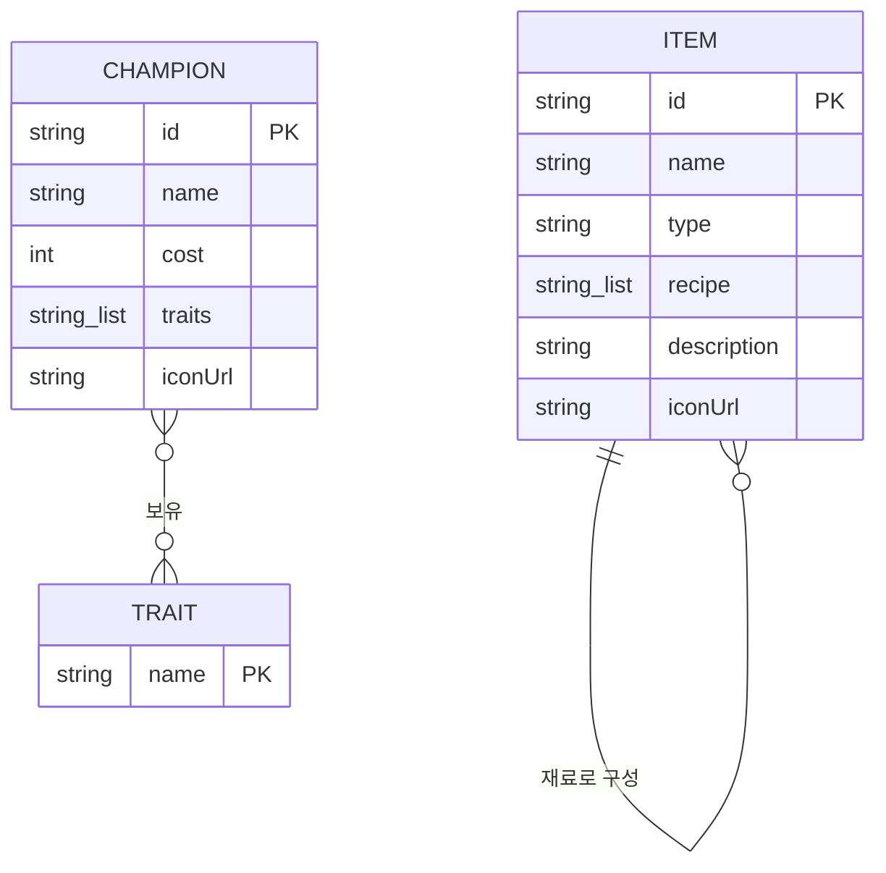

# U1 Domain Entities

기술 중립적 도메인 엔티티 정의. 저장 방식·프레임워크와 무관하다.

---

## 1. 엔티티 개요

U1 은 **정적 게임 데이터**를 다룬다. 사용자별 상태가 없고, 세트 단위로만 변하는 참조 데이터다.



### Text Alternative

```
CHAMPION (id, name, cost, traits[], iconUrl)
   └─ traits[] 는 TRAIT 의 이름 문자열 목록 (다대다)
TRAIT (name)  — 독립 엔티티로 저장하지 않음 (UQ1-C: 문자열로만 표현)
ITEM (id, name, type, recipe[], description, iconUrl)
   └─ recipe[] 는 다른 ITEM 의 id 목록 (자기참조, combined 인 경우만)
```

---

## 2. Champion

플레이어가 배치하는 유닛.

| 속성 | 타입 | 필수 | 설명 |
|---|---|---|---|
| `id` | string | ✅ | 고유 식별자. CDragon `apiName` (예: `TFT17_Briar`) |
| `name` | string | ✅ | 표시 이름 (한글) |
| `cost` | int (1~5) | ✅ | 상점 비용. 등급을 겸한다 |
| `traits` | string[] | ✅ | 보유 특성 **이름** 목록. 빈 배열이면 플레이어블 유닛이 아니다 |
| `iconUrl` | string | ✅ | 정사각 아이콘 절대 URL |

**불변식**
- `cost` 는 1~5 범위. 벗어나면 도메인에서 제외
- `traits` 는 비어 있지 않다 (비면 엔티티로 인정하지 않음 — FQ2-A)
- `id` 는 데이터셋 내 유일

**프론트 계약**: `frontend/src/types/domain.ts` 의 `Champion` 과 **동일**. 필드 추가·변경 없음.

---

## 3. Item

유닛에게 장착하는 장비.

| 속성 | 타입 | 필수 | 설명 |
|---|---|---|---|
| `id` | string | ✅ | CDragon `apiName` (예: `TFT_Item_InfinityEdge`) |
| `name` | string | ✅ | 표시 이름 (한글) |
| `type` | `component` \| `combined` | ✅ | 기본 재료 / 조합 아이템 |
| `recipe` | string[] \| null | — | `combined` 인 경우 재료 `id` 2개. `component` 는 `null` |
| `description` | string \| null | — | 효과 설명 |
| `iconUrl` | string | ✅ | 아이콘 절대 URL |

**불변식**
- `type == "combined"` ⟺ `recipe` 가 비어 있지 않다
- `type == "component"` ⟺ `recipe` 가 `null`
- **참조 무결성**: `recipe` 의 모든 원소는 동일 데이터셋에 `component` 로 존재한다
- `id` 는 유일

**자기참조 관계**: `Item.recipe` → `Item.id`. 깊이 1 (조합 아이템의 재료는 항상 기본 재료이며, 조합 아이템끼리 합쳐지지 않는다)

**프론트 계약**: `types/domain.ts` 의 `Item` 과 **동일**.

---

## 4. Trait (비영속 개념)

특성은 **독립 엔티티로 모델링하지 않는다** (UQ1-C, FQ5-A).

| 결정 | 근거 |
|---|---|
| `Champion.traits` 에 **이름 문자열로만** 존재 | CDragon 이 챔피언의 특성을 이미 한글 이름 배열로 제공한다. 변환할 것이 없다 |
| `Trait` 엔티티·테이블·엔드포인트 없음 | 아이콘·설명이 필요해지는 시점에 `cdragon.traits_raw()` 로 확장한다. 쓰이지 않을 코드를 미리 만들지 않는다 |
| 프론트의 `TraitIcon` 은 이름만 받는다 | 현재 구현이 `◆` 글리프 + 텍스트 칩이라 이미지가 필요 없다 |

---

## 5. CDragonSnapshot (내부 전용)

Gateway 가 캐시에 보관하는 원본 스냅샷. **프론트에 노출되지 않는다.**

| 속성 | 타입 | 설명 |
|---|---|---|
| `setNumber` | string | 대상 세트 (예: `"17"`) |
| `champions` | raw[] | CDragon 원본 챔피언 배열 |
| `traits` | raw[] | CDragon 원본 특성 배열 (현재 미사용, 확장 대비) |
| `items` | raw[] | CDragon 원본 아이템 배열 |
| `fetchedAt` | timestamp | 캐시 신선도 판정용 (FQ3-A TTL) |

**존재 이유**: 25MB 원본을 그대로 보관하지 않고 **필요한 부분만 추출**해 수백 KB로 줄인다.
`fetchedAt` 이 TTL 판정의 기준이 된다.

---

## 6. 엔티티 생명주기

| 엔티티 | 생성 | 갱신 | 삭제 |
|---|---|---|---|
| `Champion`, `Item` | 요청 시 CDragon 스냅샷에서 파생 | 스냅샷 갱신 시 자동 | 없음 (읽기 전용) |
| `CDragonSnapshot` | 최초 페치 시 | TTL 만료 후 재페치 | 캐시 파일 수동 삭제 |

**모든 엔티티가 읽기 전용이다.** 생성·수정·삭제 API 가 없으므로 동시성 제어나 트랜잭션이 필요 없다.

---

## 7. 도메인 경계

| 포함 | 제외 |
|---|---|
| 챔피언 · 아이템 정적 정보 | 챔피언별 통계(평균등수·픽률) — 전처리 데이터 영역(`dataset.py`) |
| 아이템 조합 관계 | 아이템 사용률 통계 — 범위 밖 |
| 특성 이름 | 특성 효과·발동 조건 — 이번 범위 밖 |
| — | 증강체(Augment) — Set 17 데이터에 없음 |
| — | 소환사 · 매치 · 랭킹 — `riot_live.py` 영역 |
