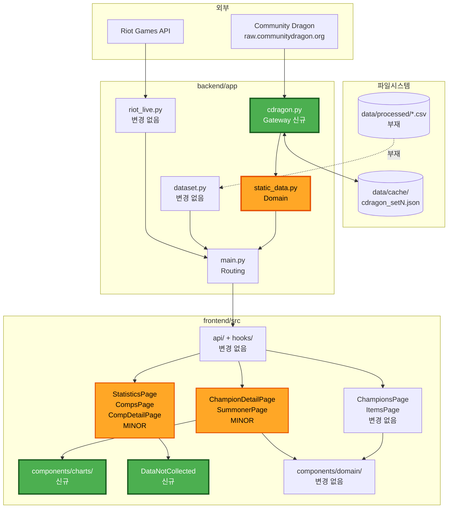

# Component Dependency

의존 매트릭스 · 통신 패턴 · 데이터 흐름.

---

## 1. 의존 그래프 (변경 후)



**범례**: 초록 = 신규, 주황 = 변경, 무색 = 변경 없음

### Text Alternative

```
Community Dragon → cdragon.py(신규) ⇄ data/cache/
                        ↓
                  static_data.py(변경) → main.py → frontend api/hooks(무변경)
Riot API → riot_live.py(무변경) ────────↗              ↓
data/processed CSV(부재) ⇢ dataset.py(무변경) ────↗    ├→ ChampionsPage·ItemsPage (무변경)
                                                      ├→ ChampionDetailPage·SummonerPage (변경) → charts/(신규)
                                                      └→ Statistics·Comps·CompDetail (변경) → DataNotCollected(신규)
```

---

## 2. 의존 매트릭스

행이 열에 의존한다. **N** = 신규 의존, **M** = 변경된 의존, **-** = 기존 유지, 빈칸 = 의존 없음.

| ↓의존 / 열→ | cdragon.py | static_data.py | riot_live.py | dataset.py | CDragon API | data/cache | types/domain.ts |
|---|---|---|---|---|---|---|---|
| `main.py` | | - | - | - | | | |
| `static_data.py` | **N** | | | | | | (계약 준수) |
| `cdragon.py` | | | | | **N** | **N** | |
| `riot_live.py` | | | | | | | |
| `dataset.py` | | | | | | | |
| `frontend/api/*` | | | | | | | - |
| `frontend/pages/*` | | | | | | | - |
| `frontend/charts/*` | | | | | | | **N** |

### 제거되는 의존 (DQ3-A)

| 제거 대상 | 사유 |
|---|---|
| `static_data.py` → `data/TFT_DDragon/` | Community Dragon 단일 소스로 전환. **미러 설치 불필요** |

### 신규 외부 의존

| 대상 | 유형 | 리스크 |
|---|---|---|
| `raw.communitydragon.org` | Runtime HTTP | A-6 (가용성·스키마 유지). 실패 시 빈 목록 degrade |
| `data/cache/` | Runtime 파일 I/O | 쓰기 권한 없으면 메모리 캐시로만 동작 (기능 유지, 재시작마다 재페치) |

---

## 3. 통신 패턴

| 경로 | 패턴 | 프로토콜 | 동기/비동기 | 실패 처리 |
|---|---|---|---|---|
| SPA → backend | Request/Response | HTTP GET, JSON | 동기 (React Query 관리) | `QueryBoundary` 가 Error/Empty 분기 |
| `main.py` → `static_data.py` | 직접 함수 호출 | in-process | 동기 | 예외 없음 (빈 목록) |
| `static_data.py` → `cdragon.py` | 직접 함수 호출 | in-process | 동기 | 예외 없음 (빈 목록) |
| `cdragon.py` → Community Dragon | Fetch-and-cache | HTTPS GET | 동기, **1회성** | 예외 흡수 → 빈 구조 |
| `cdragon.py` ⇄ `data/cache/` | Read-through / Write-behind | 파일 I/O | 동기 | 실패 시 메모리 캐시로 폴백 |

### 결합도 평가

| 결합 지점 | 결합도 | 근거 |
|---|---|---|
| `static_data.py` ↔ `cdragon.py` | **낮음** | 원본 dict 목록만 주고받음. Gateway 교체 시 변환 로직 영향 없음 |
| backend ↔ frontend | **낮음 (계약 기반)** | `types/domain.ts` 형태를 백엔드가 준수. **이번 작업에서 계약이 변하지 않음** |
| `cdragon.py` ↔ Community Dragon | **중간** | 원본 스키마 변경에 취약 (A-6). 필드 접근을 `_extract()` 한 곳에 모아 영향 범위를 좁힘 |
| `charts/` ↔ `types/domain.ts` | **낮음** | `Match[]` 만 소비 |

---

## 4. 데이터 흐름

### 4.1 정적 데이터 (신규 경로)

```mermaid
flowchart LR
    A["CDragon ko_kr.json<br/>25MB"] -->|"_extract()"| B["세트 추출본<br/>수백 KB"]
    B -->|"디스크 저장"| C[("cdragon_setN.json")]
    C -->|"_load_or_fetch()"| D["원본 dict 목록"]
    D -->|"_to_champion()<br/>_to_item()<br/>_to_trait()"| E["도메인 모델<br/>Champion / Item / Trait"]
    E -->|"asset_url()"| F["iconUrl 채워진 모델"]
    F -->|"JSON 응답"| G["프론트 기존 컴포넌트<br/>무변경"]

    style A fill:#FFCDD2,stroke:#B71C1C,color:#000
    style B fill:#FFF9C4,stroke:#F57F17,color:#000
    style F fill:#C8E6C9,stroke:#2E7D32,color:#000
```



**Text Alternative**
```
CDragon 25MB → 세트 필드 추출(수백 KB) → 디스크 캐시
  → 원본 dict → 도메인 변환(_to_champion/_to_item/_to_trait)
  → asset_url()로 iconUrl 부착 → JSON → 프론트(무변경 컴포넌트가 그대로 렌더)
```

### 4.2 변환 시 필드 매핑

| 도메인 필드 | CDragon 원본 | 비고 |
|---|---|---|
| `Champion.id` | `apiName` | 예 `TFT17_Briar` |
| `Champion.name` | `name` | 이미 한글 |
| `Champion.cost` | `cost` | 1~5 검증 |
| `Champion.traits` | `traits[]` | **이미 한글** — 매핑 레이어 불필요 |
| `Champion.iconUrl` | `tileIcon` | ⚠️ `squareIcon` 이 아님 — 그쪽은 스플래시 아트 |
| `Item.id` | `apiName` | |
| `Item.name` | `name` | |
| `Item.type` | `composition` 유무 | 있으면 `combined`, 없으면 `component` |
| `Item.recipe` | `composition[]` | 재료 `apiName` 배열 |
| `Item.description` | `desc` | |
| `Item.iconUrl` | `icon` | |
| `Trait.id` / `.name` / `.iconUrl` | `apiName` / `name` / `icon` | |

### 4.3 데이터 없는 경로 (변경 없음, 표현만 개선)

```
data/processed/*.csv (부재)
  → dataset.has_data() == False
  → compute_statistics() 가 NO_DATA_PATCH 폴백 반환
  → main.py 가 supportedFilters:{patch:false,tier:false} 동봉  ← [신규]
  → StatisticsPage 가 DataNotCollected 표시 + 필터 비활성      ← [신규]
```

---

## 5. 유닛별 의존 (Units Generation 입력)

| Unit | 대상 컴포넌트 | 선행 의존 |
|---|---|---|
| **U1** | C-1 `cdragon.py`(신규), C-4 `static_data.py`, C-5 `main.py` | 없음 |
| **U2** | C-6 `ChampionDetailPage` (+ ChampionsPage·ItemsPage **동작 확인만**) | **U1** — 실제 응답이 있어야 검증 가능 |
| **U3** | C-3 `DataNotCollected`(신규), C-7 3개 페이지 | 없음 (`supportedFilters` 사용 시 U1 의 C-5 부분만) |
| **U4** | C-2 `charts/`(신규), C-8 `SummonerPage` | 없음 — 라이브 Riot 데이터 사용 |
| **U5** | C-9 `SearchBar`, 아이콘 검증, `gold`→`brand` | **U1** (iconUrl 생성) |

**임계 경로**: U1 → U2. U3·U4 는 U1 과 병행 가능.

**롤백 경계**: U1 실패 시 `cdragon.py` 삭제 + `static_data.py` 되돌림으로 기존 동작(빈 배열) 복귀.
프론트는 이미 graceful degradation 이 있어 영향 없음.

---

## 6. 순환 의존 검증

```
main.py → static_data.py → cdragon.py → (외부)
main.py → dataset.py → (파일)
main.py → riot_live.py → (외부)
```

**순환 없음.** 모든 백엔드 의존이 단방향 하향이며, Gateway 계층이 말단이다.

프론트엔드도 `pages → components → lib/types` 단방향이 유지된다.
신규 `charts/` 는 `types/domain.ts` 만 참조하므로 컴포넌트 간 순환을 만들지 않는다.
