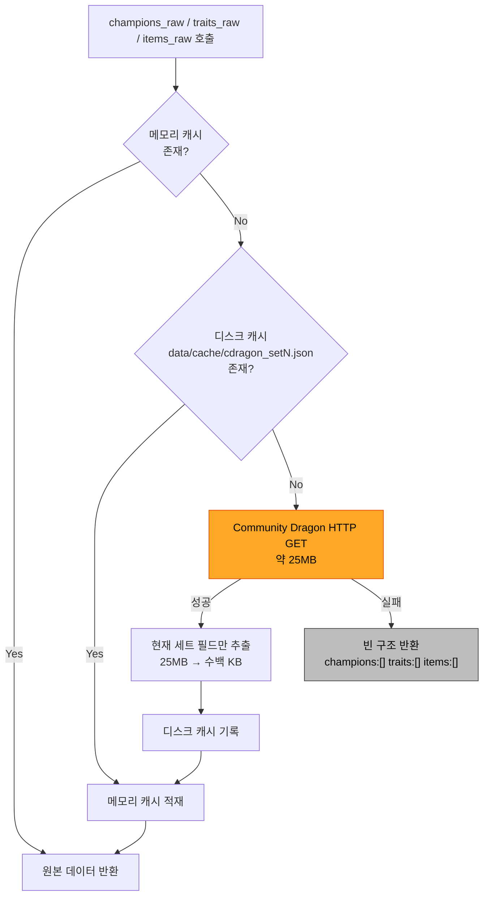
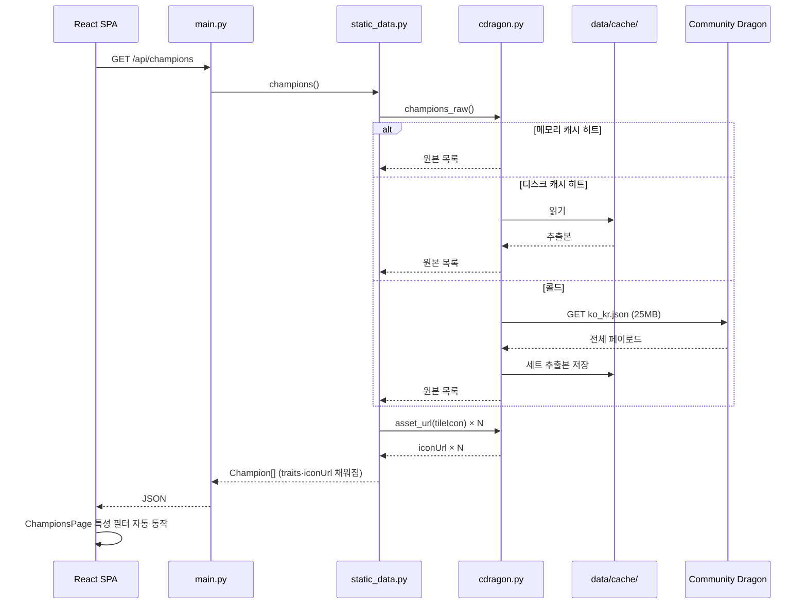

# Services

서비스 정의와 오케스트레이션 패턴.

---

## 서비스 계층 구조 (변경 후)

백엔드는 **3계층**으로 정리된다. 이번 작업은 이 중 정적 데이터 경로만 재구성한다.

| 계층 | 역할 | 이번 작업 |
|---|---|---|
| **Routing** (`main.py`) | HTTP 엔드포인트, CORS, 예외 → HTTPException 변환 | MINOR |
| **Domain Service** (`static_data.py`, `dataset.py`, `riot_live.py`) | 도메인 모델 조립 | `static_data.py` 만 MAJOR |
| **Gateway** (`cdragon.py` 신규) | 외부 소스 접근 · 캐싱 | 신규 |

> **신규 계층의 의미**: 기존에는 Domain Service 가 외부 접근까지 겸했다
> (`riot_live.py` 가 HTTP·캐시·변환을 모두 안고 416줄이 된 원인). Gateway 를 분리해 이 패턴을 반복하지 않는다.

---

## S-1. CDragon Gateway Service (`cdragon.py`)

**Purpose**: Community Dragon 을 유일하게 접촉하는 계층.

**Responsibilities**
- 원격 페치 (25MB, 1회)
- 3단 캐시 오케스트레이션
- 필드 추출로 캐시 크기 축소
- 에셋 URL 변환
- 실패 격리 — 상위 계층에 예외를 전파하지 않음

**Non-Responsibilities** (명시적 제외)
- 도메인 모델 변환 → `static_data.py`
- 세트 필터링 규칙 판단 → `static_data.py`
- HTTP 응답 형태 결정 → `main.py`

### 캐시 오케스트레이션 (DQ2-B)



**Text Alternative**
```
호출 → 메모리 캐시 있으면 즉시 반환
     → 없으면 디스크 캐시 확인, 있으면 메모리 적재 후 반환
     → 없으면 CDragon HTTP GET (25MB)
          성공 → 현재 세트 필드만 추출(수백 KB) → 디스크 저장 → 메모리 적재 → 반환
          실패 → 빈 구조 반환 (500 아님)
```

**성능 특성**

| 시나리오 | 지연 |
|---|---|
| 메모리 히트 (2회차 이후 요청) | 즉시 |
| 디스크 히트 (서버 재시작 후 첫 요청) | 수십 ms |
| 콜드 (최초 1회) | 25MB 다운로드 시간 |
| 네트워크 실패 | 즉시 (빈 목록) |

> 개발 중 `uvicorn --reload` 로 잦은 재시작이 발생해도 **디스크 캐시 덕분에 재다운로드가 없다.**
> 이것이 DQ2-B 를 선택한 핵심 이유다 (R-6 완화).

---

## S-2. Static Data Domain Service (`static_data.py`)

**Purpose**: CDragon 원본을 프론트엔드 계약에 맞는 도메인 모델로 변환한다.

**Responsibilities**
- 챔피언 · 아이템 · 특성 도메인 모델 조립
- 현재 세트 필터링, 비플레이어 유닛 제외
- `component`/`combined` 판정
- `iconUrl` 완성 (DQ4-A)
- 정렬 규칙 적용

**Orchestration**: `cdragon.py` 에서 원본을 받아 순수 변환만 수행한다.
자체 캐싱은 `lru_cache` 로 유지하되, **원본 캐싱은 Gateway 에 위임**한다.

> ⚠️ **기존 `lru_cache` 의 함정 재발 방지**: `dataset.py` 는 `lru_cache` 때문에 CSV 갱신이 반영되지 않는 문제가
> 있다(TD-3). `static_data.py` 도 같은 패턴을 쓰지만, 정적 게임 데이터는 세트 단위로만 바뀌므로
> 프로세스 수명 내 불변으로 취급해도 안전하다. **이 판단을 코드 주석에 남긴다.**

---

## S-3. 변경 없는 서비스

| 서비스 | 상태 |
|---|---|
| `riot_live.py` — 라이브 Riot 게이트웨이 | 변경 없음 (범위 밖). 전적검색·랭킹이 계속 실데이터 제공 |
| `dataset.py` — 전처리 CSV 통계 | 변경 없음 (범위 밖). CSV 부재로 빈 응답 유지 → 프론트가 `DataNotCollected` 표시 |

---

## 서비스 간 오케스트레이션

### 요청 흐름 — `/api/champions`



**Text Alternative**
```
SPA → GET /api/champions → main.py → static_data.champions()
  → cdragon.champions_raw()  [메모리 → 디스크 → 원격 순]
  → static_data 가 도메인 변환 + asset_url() 로 iconUrl 생성
  → Champion[] 반환 (traits 채워짐)
  → ChampionsPage 의 기존 필터 로직이 그대로 동작
```

### 서비스 경계 원칙

| 원칙 | 내용 |
|---|---|
| **단방향 의존** | `main.py` → `static_data.py` → `cdragon.py`. 역방향 참조 금지 |
| **Gateway 격리** | 외부 HTTP·파일 I/O 는 `cdragon.py` 에만 존재. `static_data.py` 는 순수 변환 |
| **실패 흡수 지점** | Gateway 에서 흡수. Domain Service 와 Routing 은 빈 목록을 정상 값으로 취급 |
| **서비스 간 무공유** | `riot_live.py` 와 `cdragon.py` 는 서로 모른다. 각자의 캐시를 갖는다 |

> **의도적 중복 허용**: `riot_live.py` 도 특성 이름 매핑(`_trait_name_map`)을 갖고 있어 `cdragon.py` 와 기능이 겹친다(TD-7).
> 통합은 `riot_live.py` 수정을 요구하므로 **범위 밖**이다. 향후 정리 대상으로 남긴다.

---

## 프론트엔드 서비스 계층 (변경 없음)

| 계층 | 구성 | 상태 |
|---|---|---|
| API Client | `api/*.ts` + `client.ts` (`USE_MOCK` 스위치) | 변경 없음 |
| Server State | `hooks/*.ts` (React Query) | 변경 없음 |
| Presentation | `pages/*`, `components/*` | 일부 MINOR |

**설계 결정**: 프론트엔드 데이터 계층은 손대지 않는다. 목/실 전환 스위치와 React Query 캐싱이 이미 올바르게 작동하며,
백엔드 응답 형태가 바뀌지 않으므로(필드가 채워질 뿐) 변경 이유가 없다. NFR-6(목 모드 회귀 방지)도 자동으로 충족된다.
