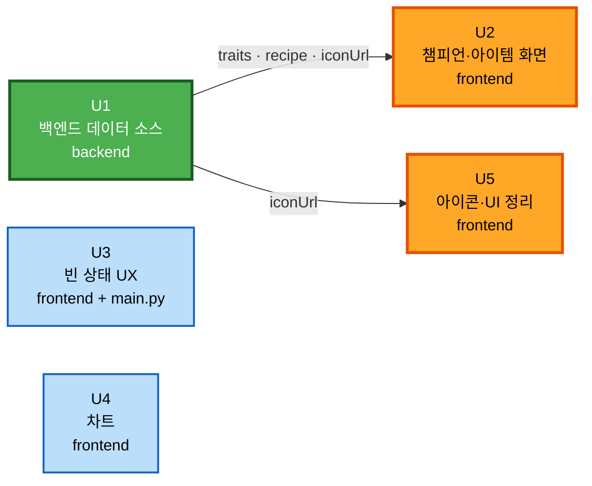

# Unit of Work Dependency

---

## 1. 의존 그래프



**범례**: 초록 = 임계 경로 시작, 주황 = U1 의존, 파랑 = 독립

### Text Alternative

```
U1 ──(traits · recipe · iconUrl)──> U2
U1 ──(iconUrl)──────────────────> U5
U3  독립 (선행 의존 없음)
U4  독립 (선행 의존 없음)
```

---

## 2. 의존 매트릭스

행이 열에 의존한다.

| ↓의존 / 열→ | U1 | U2 | U3 | U4 | U5 |
|---|---|---|---|---|---|
| **U1** | — | | | | |
| **U2** | ✅ | — | | | |
| **U3** | | | — | | |
| **U4** | | | | — | |
| **U5** | ✅ | | | | — |

**의존 총 2건.** U3·U4 는 어떤 유닛에도 의존하지 않는다.

### 의존 상세

| 의존 | 유형 | 이유 | 차단 여부 |
|---|---|---|---|
| U2 → U1 | **데이터 (Runtime)** | `ChampionDetailPage` 가 표시할 `traits`, 필터가 쓸 특성 목록, 아이템 `type`·`recipe` 를 U1 이 공급한다 | **차단** — U1 없이는 검증 불가 |
| U5 → U1 | **데이터 (Runtime)** | 아이콘 표시 검증에 U1 이 생성한 `iconUrl` 이 필요하다 | **부분 차단** — `SearchBar` 파싱과 `gold`→`brand` 는 U1 없이도 가능 |

### 의존이 아닌 것 (명시)

| 관계 | 왜 의존이 아닌가 |
|---|---|
| U3 → U1 | `supportedFilters` 가 UQ2-B 로 **U3 내부로 이동**했다. U3 이 `main.py` 한 줄과 그 소비처를 함께 소유하므로 U1 을 기다릴 필요가 없다 |
| U4 → U1 | 차트는 `/api/summoner` 의 **라이브 Riot 데이터**를 쓴다. 정적 데이터 소스와 무관 |
| U2 → U3 | 서로 다른 페이지를 다룬다. 공유 컴포넌트 없음 |
| U4 → U3 | `PlacementChart` 는 자체 빈 상태를 처리한다. `DataNotCollected` 를 쓰지 않는다 |

---

## 3. 실행 순서 (UQ3-B)

```
1. U1  백엔드 데이터 소스        ← 임계 경로 시작
2. U3  빈 상태 UX               ← U1 과 병행 가능, 순차 진행 시 여기
3. U4  차트                     ← U1 과 병행 가능
4. U2  챔피언·아이템 화면        ← U1 결과 확인 후
5. U5  아이콘·UI 정리           ← 마무리
```

### 순서 근거

| 위치 | 근거 |
|---|---|
| U1 이 첫 번째 | 유일한 임계 경로 시작점. 두 유닛이 이것을 기다린다 |
| U3·U4 가 중간 | U1 과 독립이므로 U2 를 기다리는 동안의 공백을 채운다. 순수 프론트 작업이라 백엔드 상태와 무관 |
| U2 가 U3·U4 뒤 | **U1 이 실제로 무엇을 반환하는지 눈으로 확인한 뒤** 진행하는 것이 안전하다. DQ8-A 로 축소된 유닛이라 늦게 배치해도 손실이 적다 |
| U5 가 마지막 | 아이콘 검증과 `gold`→`brand` 정리가 **다른 유닛에서 수정한 파일들을 대상으로 하므로** 마지막이 자연스럽다 |

### 병행 가능성

U3·U4 는 U1 과 동시에 진행해도 충돌하지 않는다 (패키지가 다르거나 파일이 겹치지 않음).
다만 AI-DLC 는 유닛 단위 완결을 기본으로 하므로 **본 계획은 순차 진행을 채택**한다.

---

## 4. 파일 충돌 분석

여러 유닛이 같은 파일을 건드리는지 확인한다.

| 파일 | U1 | U2 | U3 | U4 | U5 | 충돌 |
|---|---|---|---|---|---|---|
| `backend/app/services/cdragon.py` | 신규 | | | | | 없음 |
| `backend/app/services/static_data.py` | MAJOR | | | | | 없음 |
| `backend/app/main.py` | | | MINOR | | | 없음 |
| `backend/requirements.txt` | 수정 | | | | | 없음 |
| `frontend/src/pages/ChampionDetailPage.tsx` | | MINOR | | | ⚠️ | **주의** |
| `frontend/src/pages/StatisticsPage.tsx` | | | MINOR | (FR-4.5) | ⚠️ | **주의** |
| `frontend/src/pages/CompsPage.tsx` | | | MINOR | | ⚠️ | **주의** |
| `frontend/src/pages/CompDetailPage.tsx` | | | MINOR | | ⚠️ | **주의** |
| `frontend/src/pages/SummonerPage.tsx` | | | | MINOR | ⚠️ | **주의** |
| `frontend/src/components/feedback/DataNotCollected.tsx` | | | 신규 | | | 없음 |
| `frontend/src/components/charts/*` | | | | 신규 | | 없음 |
| `frontend/src/components/common/SearchBar.tsx` | | | | | MINOR | 없음 |
| `frontend/package.json` | | | | 수정 | | 없음 |

### ⚠️ 표시의 의미

U5 의 **`gold` → `brand` 정리(FR-7.1)가 "이번 작업에서 수정한 파일"을 대상으로 하므로**,
U2·U3·U4 가 건드린 페이지 파일을 U5 가 다시 연다.

**충돌이 아닌 이유**: U5 는 순서상 **마지막**이고, 앞 유닛들이 이미 완료된 상태에서 시작한다.
동시 편집이 아니라 순차 재방문이므로 안전하다.

**단, FR-4.5(StatisticsPage 차트 컴포넌트 배치)와 U3(StatisticsPage 빈 상태)이 같은 파일을 다룬다.**
U3 이 먼저이므로 U4 는 U3 의 결과 위에 작업한다. 이 순서를 지켜야 한다.

---

## 5. 롤백 경계

| Unit | 롤백 방법 | 영향 범위 | 복구 후 상태 |
|---|---|---|---|
| **U1** | `cdragon.py` 삭제 + `static_data.py` 되돌림 | backend 만 | 챔피언·아이템이 빈 배열. 프론트는 graceful degradation 으로 EmptyState 표시 |
| **U3** | 3개 페이지 + `main.py` 되돌림 | frontend + backend 1줄 | 기존 `-` 카드 / 빈 목록으로 복귀 |
| **U4** | `charts/` 삭제 + `SummonerPage` 되돌림 + package.json | frontend | 차트 없는 기존 전적검색 |
| **U2** | `ChampionDetailPage` 되돌림 | frontend 1파일 | "준비 중" EmptyState 복귀 |
| **U5** | 파일 단위 되돌림 | frontend | 아이콘 폴백 텍스트, `gold` 클래스 유지 |

**전체 롤백**: `git checkout -- .` (커밋을 하지 않으므로 — UQ4-B).

> **롤백이 쉬운 근본 이유**: 프론트엔드 데이터 계약(`types/domain.ts`)을 바꾸지 않기 때문에,
> 어느 유닛을 되돌려도 나머지가 계속 컴파일되고 동작한다.

---

## 6. 검증 체크포인트

| 시점 | 검증 내용 | 방법 |
|---|---|---|
| U1 완료 후 | 응답에 `traits`·`recipe`·`iconUrl` 이 실제로 채워졌는가 | `curl localhost:8000/api/champions`, `/api/items` |
| U1 완료 후 | 네트워크 실패 시 500 이 아닌 빈 목록인가 | 오프라인 상태로 재시작 |
| U3 완료 후 | 통계·전략가 페이지에 안내가 표시되는가 | 브라우저 |
| U4 완료 후 | 실제 소환사 검색 시 차트가 렌더되는가 | 브라우저 (유효한 Riot 키 필요) |
| U2 완료 후 | 특성 필터·아이템 탭이 실제로 동작하는가 | 브라우저 — **U1 검증의 최종 확인** |
| U5 완료 후 | 아이콘 실이미지 표시, 폴백 유지 | 브라우저 |
| 각 유닛 후 | 타입 안전성 | `npm run typecheck` |
| 전체 후 | 회귀 — 목 모드 복귀 시 정상 동작 (NFR-6) | `VITE_USE_MOCK=true` 로 전환 후 전 화면 |

---

## 7. 순환 의존 검증

```
U1 → U2
U1 → U5
U3, U4 독립
```

**순환 없음.** 모든 의존이 U1 에서 출발하는 단방향이다.
