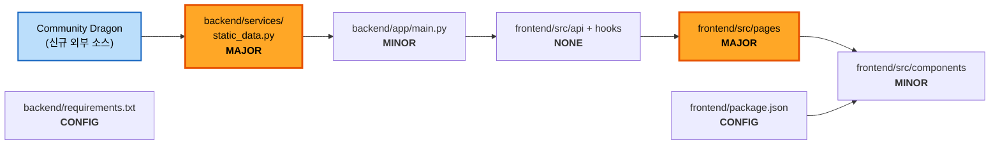
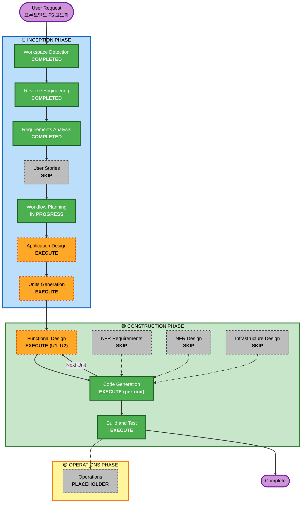
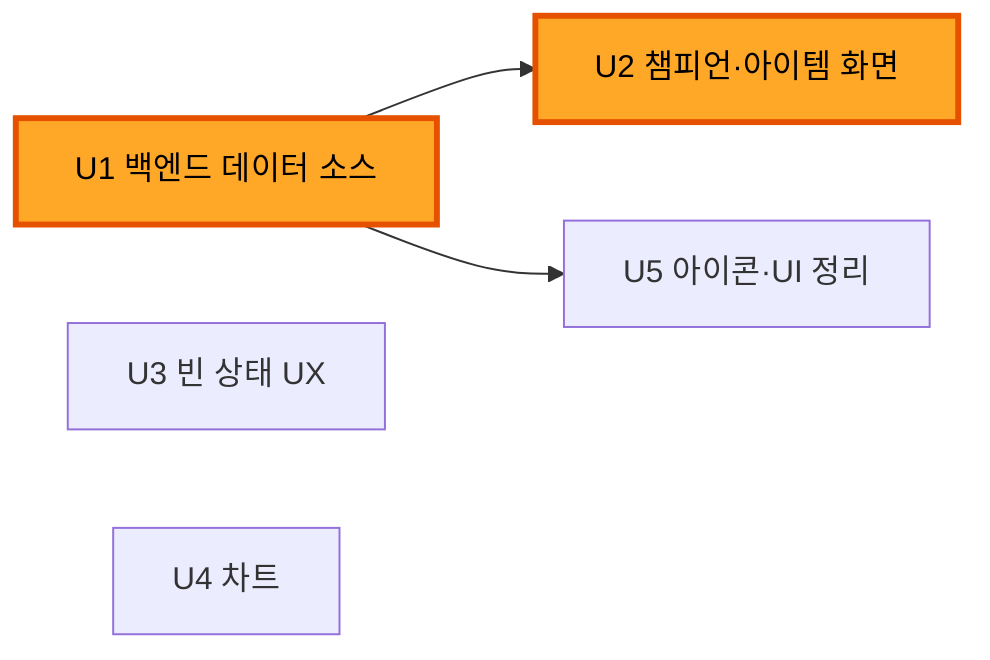

# Execution Plan — 프론트엔드 F5 고도화

**작성일**: 2026-08-03
**대상 Git HEAD**: 1d05ca8
**요구사항 출처**: `aidlc-docs/inception/requirements/requirements.md` (2026-08-03 개정판)

---

## 1. Detailed Analysis Summary

### 1.1 Transformation Scope (Brownfield)

| 항목 | 판정 |
|---|---|
| **Transformation Type** | **Single-tier application change** — 아키텍처 변경 없음 |
| **Primary Changes** | ① 백엔드 정적 데이터 소스를 DDragon 미러 → **Community Dragon** 으로 교체 ② 그 데이터로 프론트엔드 챔피언·아이템 화면 활성화 ③ 데이터 없는 화면의 빈 상태 UX 개선 ④ Recharts 차트 도입 |
| **Related Components** | `frontend/` (주), `backend/app/services/static_data.py` + `backend/app/main.py` (부) |
| **Infrastructure Changes** | **없음** — 배포·컨테이너·CI 모두 범위 밖 |
| **Deployment Model Changes** | **없음** — 로컬 개발 환경 유지 |

### 1.2 Change Impact Assessment

| 영역 | 영향 | 설명 |
|---|---|---|
| **User-facing changes** | **Yes (큼)** | 챔피언 특성 필터·상세, 아이템 분류·조합법, 등수 분포 차트, 빈 상태 안내가 모두 사용자에게 보이는 변화 |
| **Structural changes** | **No** | 패키지 구성·레이어 분리·라우팅 구조 불변 |
| **Data model changes** | **Yes (경미)** | `types/domain.ts` 의 `Champion.traits`·`Item.type`·`Item.recipe` 가 처음으로 실제 값을 갖게 됨. **타입 정의 자체는 이미 존재하므로 스키마 변경 아님** |
| **API changes** | **Yes (하위 호환)** | `/api/champions`·`/api/items` 응답 필드가 채워짐. 기존 계약 위반 없음 — 빈 배열이 실제 값으로 바뀔 뿐 |
| **NFR impact** | **Yes (경미)** | Community Dragon 25MB 페이로드로 인한 콜드 스타트 지연 → 캐싱으로 대응 (FR-3.5) |

### 1.3 Component Relationships



**Text Alternative**
```
Community Dragon (신규) → static_data.py (MAJOR) → main.py (MINOR) → frontend api/hooks (변경 없음)
                                                                    → frontend pages (MAJOR) → components (MINOR)
frontend/package.json (CONFIG, Recharts 추가) → components
backend/requirements.txt (CONFIG, pandas 추가)
```

| 컴포넌트 | Change Type | Change Reason | Priority |
|---|---|---|---|
| `backend/app/services/static_data.py` | **Major** | 데이터 소스 전면 교체 (DDragon 미러 → Community Dragon), 특성·조합법 매핑 신규 | **Critical** |
| `frontend/src/pages/{Champions,ChampionDetail,Items}Page.tsx` | **Major** | 특성 필터·조합법 탭 활성화, 상세 EmptyState 실내용 교체 | **Critical** |
| `frontend/src/pages/{Statistics,Comps,CompDetail}Page.tsx` | **Minor** | 빈 상태 안내 개선 | Important |
| `frontend/src/pages/SummonerPage.tsx` | **Minor** | 등수 분포 차트·요약 지표 추가 | Important |
| `backend/app/main.py` | **Minor** | `patch`/`tier` 파라미터 처리 또는 미지원 명시 | Optional |
| `frontend/package.json` | **Config** | Recharts 추가 | Important |
| `backend/requirements.txt` | **Config** | pandas 추가 (기존 누락 보완) | Optional |
| `frontend/src/api/*`, `hooks/*`, `types/domain.ts` | **None** | 계약이 이미 올바름 — **변경 불필요** | - |

> **주목**: 프론트엔드 API 계층과 타입 정의는 **손댈 필요가 없습니다.**
> 원 설계가 `Champion.traits`·`Item.recipe` 를 미리 정의해 두었기 때문에, 백엔드가 값을 채우면 그대로 흐릅니다.
> 이것이 PRD §7 의 "API 타입 계약 선정의" 결정이 실제로 값을 낸 지점입니다.

### 1.4 Risk Assessment

| 항목 | 평가 |
|---|---|
| **Risk Level** | **Low-Medium** |
| **Rollback Complexity** | **Easy** — 2개 패키지, DB 마이그레이션 없음, `git revert` 로 완전 복구 |
| **Testing Complexity** | **Simple-Moderate** — 순수 변환 함수(CDragon → 도메인 모델)가 테스트 대상의 핵심 |

**Low-Medium 근거**
- 아키텍처·배포 모델 불변, 인프라 무관
- 외부 소스 1개 추가가 유일한 새 의존 (R-6, A-6)
- 최대 리스크였던 R-1 은 착수 전 검증으로 **이미 해소**
- 기존 graceful degradation 패턴이 살아 있어 실패해도 빈 화면일 뿐 500 이 아님

---

## 2. Workflow Visualization



### Text Alternative

```
🔵 INCEPTION
  Workspace Detection ......... COMPLETED
  Reverse Engineering ......... COMPLETED
  Requirements Analysis ....... COMPLETED
  User Stories ................ SKIP
  Workflow Planning ........... IN PROGRESS
  Application Design .......... EXECUTE
  Units Generation ............ EXECUTE

🟢 CONSTRUCTION  (유닛별 반복)
  Functional Design ........... EXECUTE (U1, U2 만)
  NFR Requirements ............ SKIP
  NFR Design .................. SKIP
  Infrastructure Design ....... SKIP
  Code Generation ............. EXECUTE (전 유닛)
  Build and Test .............. EXECUTE

🟡 OPERATIONS
  Operations .................. PLACEHOLDER
```

---

## 3. Phases to Execute

### 🔵 INCEPTION PHASE

- [x] **Workspace Detection** — COMPLETED
- [x] **Reverse Engineering** — COMPLETED (9개 산출물, HEAD 1d05ca8 기준 갱신)
- [x] **Requirements Analysis** — COMPLETED (16문항, 모순 3건 해소, A-1 검증으로 개정)
- [x] **User Stories** — **SKIP**
  - **Rationale**: 페르소나 단일(TFT 플레이어), `docs/PRD.md` §6 이 이미 화면별 요구사항을 정의, 새 사용자 워크플로우 없음. 기존 기능의 고도화이므로 스토리가 추가할 정보가 적다
- [x] **Workflow Planning** — IN PROGRESS (본 문서)
- [ ] **Application Design** — **EXECUTE** (depth: Standard)
  - **Rationale**: Community Dragon 이라는 **새 외부 데이터 소스**를 도입한다. 25MB 페이로드의 캐싱 전략, 기존 DDragon 경로와의 폴백 순서, CDragon 스키마 → `types/domain.ts` 도메인 모델 매핑 규칙이 모두 설계 판단을 요한다. 프론트엔드에도 신규 컴포넌트(차트·데이터 미수집 안내)가 추가된다. "기존 컴포넌트 경계 내 변경"으로 보기 어렵다
- [ ] **Units Generation** — **EXECUTE** (depth: Minimal)
  - **Rationale**: 2개 패키지에 걸친 API 응답 변경이 있고, 작업이 명확한 의존 순서를 갖는다(백엔드 데이터 확보 → 프론트 화면 활성화). 유닛 분해로 각 단위를 독립 검증할 수 있다. 다만 유닛 수가 적어 depth 는 Minimal

### 🟢 CONSTRUCTION PHASE

- [ ] **Functional Design** — **EXECUTE (U1, U2 한정)**
  - **Rationale (U1 실행)**: CDragon JSON → `Champion`/`Item` 도메인 모델 변환 규칙이 실질적 비즈니스 로직이다. 현재 세트 필터링(`TFT17_`), Summon/PVE 제외, 특성 이름 정규화, `composition` → `component`/`combined` 판정 규칙을 명세해야 한다
  - **Rationale (U2 실행)**: 특성 필터의 동작 방식(AND/OR, 다중 선택)과 아이템 분류 규칙이 정의를 요한다
  - **Rationale (U3·U4·U5 생략)**: 빈 상태 개선·차트·UI 정리는 비즈니스 로직이 없는 표현 계층 작업
- [ ] **NFR Requirements** — **SKIP**
  - **Rationale**: 확장 3종(보안·복원력·PBT) 전부 비활성. 기술 스택은 이미 확정(Recharts, CQ4-A). 유일한 성능 관심사인 CDragon 페이로드 캐싱은 FR-3.5 로 요구사항에 명시되어 있고 U1 Functional Design 에서 다룬다. 별도 스테이지를 둘 만한 NFR 이 없다
- [ ] **NFR Design** — **SKIP**
  - **Rationale**: NFR Requirements 가 생략되어 설계할 대상이 없다
- [ ] **Infrastructure Design** — **SKIP**
  - **Rationale**: 배포·컨테이너·클라우드 리소스가 모두 범위 밖(Q8-A 는 로컬 기준). 인프라 코드가 프로젝트에 존재하지 않는다
- [ ] **Code Generation** — **EXECUTE** (유닛별, ALWAYS)
  - **Rationale**: 실제 구현
- [ ] **Build and Test** — **EXECUTE** (ALWAYS)
  - **Rationale**: `npm run build`·`typecheck`·`test` 및 로컬 기동 검증. NFR-1 완료 기준 충족 확인

### 🟡 OPERATIONS PHASE

- [ ] **Operations** — PLACEHOLDER
  - **Rationale**: 향후 배포·모니터링 워크플로우용 자리표시자. 현재 범위 밖

---

## 4. Units of Work (예비 분해 — Units Generation 에서 확정)

| Unit | 이름 | 포함 요구사항 | 의존 | Functional Design |
|---|---|---|---|---|
| **U1** | 백엔드 정적 데이터 소스 교체 | FR-1.1', FR-3.1, FR-3.2, FR-3.5, FR-3.4 | 없음 | **EXECUTE** |
| **U2** | 챔피언 · 아이템 화면 활성화 | FR-5.1, FR-5.2, FR-5.3 | **U1** | **EXECUTE** |
| **U3** | 빈 상태 UX 개선 | FR-2.1~2.4, FR-5.4, FR-3.3 | 없음 | SKIP |
| **U4** | 차트 도입 | FR-4.1~4.5 | 없음 | SKIP |
| **U5** | 아이콘 연결 · UI 정리 | FR-6.1~6.3, FR-7.1, FR-7.2 | U1 (아이콘 URL) | SKIP |

### Unit Dependency



**Text Alternative**: `U1 → U2`, `U1 → U5`. `U3`·`U4` 는 독립(선행 의존 없음).

---

## 5. Package Change Sequence (Brownfield)

### Module Update Strategy

| 항목 | 내용 |
|---|---|
| **Update Approach** | **Sequential (핵심 경로) + Parallel (독립 유닛)** |
| **Critical Path** | `backend/services/static_data.py` (U1) → `frontend/src/pages` 챔피언·아이템 (U2) |
| **Coordination Points** | `types/domain.ts` 의 `Champion`·`Item` 계약. **변경하지 않는 것이 조정 규칙** — 백엔드가 이 형태에 맞추고, 프론트는 그대로 소비 |
| **Testing Checkpoints** | ① U1 완료 후 `curl /api/champions`·`/api/items` 로 응답에 `traits`·`recipe` 가 실제로 채워졌는지 확인 ② 각 유닛 완료 후 `npm run typecheck` ③ 전체 완료 후 Build and Test |
| **Rollback Strategy** | 유닛별 커밋 분리. U1 실패 시 `static_data.py` 만 되돌리면 기존 동작(빈 배열) 복귀 — 프론트는 graceful degradation 으로 이미 대응됨 |

### 실행 순서

| 순서 | 패키지 / 유닛 | 이유 |
|---|---|---|
| 1 | **backend** (U1) | 모든 데이터 소비의 선행 조건. 여기서 나온 실제 응답 형태가 U2 의 전제 |
| 2 | **frontend** (U2) | U1 의 `traits`·`recipe` 가 있어야 필터·분류 탭을 검증할 수 있다 |
| 3 | **frontend** (U3, U4) | U1 과 무관 — U1 진행 중에도 병행 가능. 백엔드 응답에 의존하지 않음 |
| 4 | **frontend** (U5) | 마무리 성격. 아이콘 URL 구성에 U1 의 챔피언 id 가 필요 |

> **병행 가능성**: U3(빈 상태)와 U4(차트)는 U1 과 독립이므로, 순차 진행이 지루하면 U1 직후 함께 처리해도 무방하다.
> 다만 AI-DLC 는 유닛을 하나씩 완결(설계+코드)하는 것을 기본으로 하므로, 본 계획은 U1 → U2 → U3 → U4 → U5 순차를 기준으로 한다.

---

## 6. Estimated Timeline

| 구간 | 스테이지 수 | 예상 대화 라운드 |
|---|---|---|
| INCEPTION 잔여 (Application Design, Units Generation) | 2 | 3~4 |
| CONSTRUCTION — U1 (Functional Design + Code Generation) | 2 | 3~4 |
| CONSTRUCTION — U2 (Functional Design + Code Generation) | 2 | 3~4 |
| CONSTRUCTION — U3, U4, U5 (Code Generation only) | 3 | 4~6 |
| Build and Test | 1 | 1~2 |
| **합계** | **10 스테이지** | **14~20 라운드** |

**사용자 직접 작업**

| 항목 | 시간 |
|---|---|
| ~~DDragon 미러 클론~~ | **불필요해짐** (Community Dragon 채택의 부수 효과) |
| Riot 개발용 키 유효성 확인 · 재발급 | 2~3분 (24시간마다) |
| 각 스테이지 산출물 검토 · 승인 | 라운드당 수 분 |

**전체**: 집중 진행 시 반나절, 분산 진행 시 2~3일.

---

## 7. Success Criteria

### Primary Goal
기존 프론트엔드를 유지한 채 **PRD F5 단계를 완료**하여, `npm run dev` 로 띄운 12개 라우트 전부가
데이터가 있으면 실데이터를, 없으면 의도된 안내를 보여주는 상태로 만든다.

### Key Deliverables

| # | 산출물 | 검증 방법 |
|---|---|---|
| 1 | Community Dragon 기반 `/api/champions` — Set 17 챔피언 + **특성 채워짐** | `curl localhost:8000/api/champions` 에 비어 있지 않은 `traits` |
| 2 | Community Dragon 기반 `/api/items` — `component`/`combined` 구분 + `recipe` | `curl localhost:8000/api/items` 에 두 `type` 이 모두 존재 |
| 3 | 챔피언 특성 필터 · 챔피언 상세 특성 표시 동작 | 브라우저에서 필터 조작 |
| 4 | 아이템 분류 탭 · 조합법 Modal 동작 | 브라우저에서 탭 전환 · Modal 확인 |
| 5 | 통계 · 조합 페이지의 "데이터 수집 전" 안내 (수집 방법 포함) | 브라우저 확인 — `-` 카드가 사라졌는지 |
| 6 | 전적검색 등수 분포 차트 + 평균 등수 · Top4율 | 실제 소환사 검색 후 확인 |
| 7 | 유닛 · 아이템 · 특성 아이콘 실이미지 | 브라우저 확인, 폴백 동작 유지 |

### Quality Gates

- [ ] `npm run typecheck` 통과
- [ ] `npm run test` 통과 (신규·변경 코드의 단위 테스트 포함 — NFR-2)
- [ ] `npm run build` 성공
- [ ] 12개 라우트 전부 렌더, 콘솔 에러 0건
- [ ] **회귀 검증**: `VITE_USE_MOCK=true` 로 되돌려도 전 화면 정상 동작 (NFR-6)
- [ ] 백엔드 네트워크 차단 시에도 500 이 아닌 빈 목록 + 안내 (graceful degradation 유지)
- [ ] 수정한 파일에 한해 `gold` → `brand` 정리 완료 (FR-7.1)

### Integration Testing
- U1 완료 시점에 백엔드 응답을 직접 확인한 뒤 U2 착수 (계약 검증 체크포인트)
- 전체 완료 후 백엔드 + 프론트엔드 동시 기동 상태에서 전 화면 수동 검증

---

## 8. Out of Scope (재확인)

파이프라인 실행 · `ml/` 구현 · `dataset.py`/`riot_live.py` 수정 · 배포/인프라 · DB 도입 ·
기존 코드 포괄 테스트 · 보안/복원력 강화 · `gold`→`brand` 28개 파일 일괄 치환 · 로그인/i18n

상세는 `requirements.md` §5 참조.
