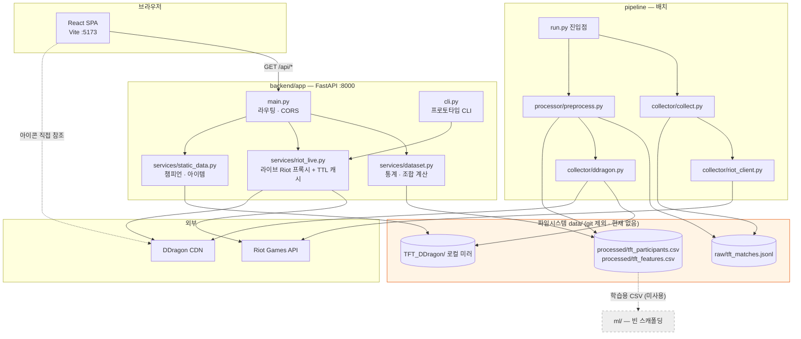
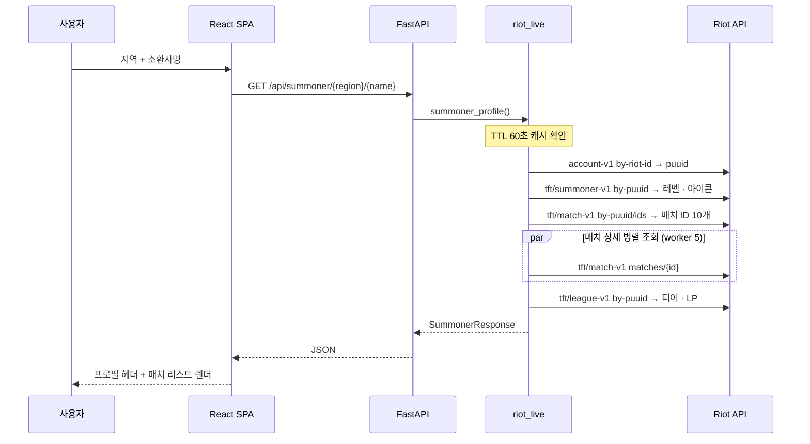
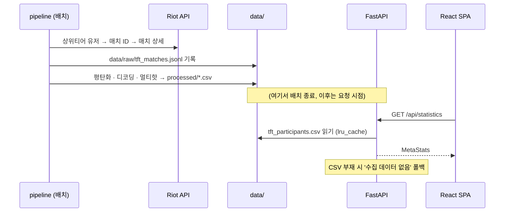

# System Architecture

## System Overview

tft-gg 는 **모노레포 구조의 3-티어 시스템**이다.

- **Presentation**: React 18 SPA (Vite dev server, 포트 5173)
- **Application**: FastAPI 서버 (uvicorn, 포트 8000)
- **Data**: 데이터베이스가 **없다**. 파일시스템 기반 —
  `data/raw/*.jsonl`(수집 원본), `data/processed/*.csv`(전처리 결과),
  `data/TFT_DDragon/`(정적 데이터 로컬 미러). 여기에 더해 라이브 Riot API 를 직접 호출한다.

> ⚠️ 루트 README 는 "Backend: FastAPI, **PostgreSQL**" 이라고 적고 있으나 **코드 어디에도 DB 연결이 없다.**
> `docker-compose.yml` 은 0바이트 빈 파일이다. 문서와 구현이 불일치한다.

## Architecture Diagram



### Text Alternative

```
브라우저(React SPA :5173)
  └─ GET /api/*  →  FastAPI(:8000) main.py
                      ├─ services/dataset.py     → data/processed/*.csv
                      ├─ services/static_data.py → data/TFT_DDragon/
                      └─ services/riot_live.py   → Riot API + DDragon CDN
  └─ 아이콘 직접 참조 → DDragon CDN

pipeline/run.py
  ├─ collector/collect.py → collector/riot_client.py → Riot API
  │                       → data/raw/tft_matches.jsonl
  └─ processor/preprocess.py → (raw + collector/ddragon.py) → data/processed/*.csv

ml/ — 빈 디렉토리 (연결 없음)
```

## Component Descriptions

### frontend
- **Purpose**: 8탭 네비게이션 · 12라우트의 TFT 정보 SPA
- **Responsibilities**: 라우팅, 디자인 시스템, React Query 기반 서버 상태 관리,
  Loading/Empty/Error 표준화, 백엔드 미가용 시 목 데이터 폴백
- **Dependencies**: backend `/api/*`, DDragon CDN(아이콘)
- **Type**: Application

### backend/app
- **Purpose**: 프론트가 기대하는 형태 그대로 JSON 을 반환하는 API 계층
- **Responsibilities**: 6개 GET 엔드포인트, CORS 허용(`*`), Riot 오류를 HTTPException 으로 변환
- **Dependencies**: `data/processed/`, `data/TFT_DDragon/`, Riot API, DDragon CDN
- **Type**: Application

### backend/app/services/riot_live.py
- **Purpose**: 라이브 Riot API 호출 전담. 커밋 f48fe45 의 CLI 프로토타입 로직을 함수로 분해한 것
- **Responsibilities**: 플랫폼/대륙 라우팅 분기, 429·5xx 재시도, 스레드 안전 TTL 캐시,
  ThreadPoolExecutor(max_workers=5) 병렬 조회, 티어 표기 포맷팅, 특성 ID→한글 조합명 변환
- **Dependencies**: Riot API, DDragon CDN 또는 로컬 미러의 `trait.json`
- **Type**: Application (외부 연동)

### backend/app/services/dataset.py
- **Purpose**: 전처리 CSV → 프론트가 쓰는 `MetaStats` · `Comp[]` 로 변환
- **Responsibilities**: 보드를 '유닛 수 상위 특성 2개' 시그니처로 그룹핑, 표본 15판 미만 제외,
  평균등수→티어 매핑, `lru_cache` 로 1회 계산 후 메모리 캐시, CSV 부재 시 빈 응답 폴백
- **Dependencies**: `data/processed/tft_participants.csv`, pandas
- **Type**: Application

### backend/app/services/static_data.py
- **Purpose**: DDragon 로컬 미러에서 챔피언 · 아이템 목록 생성
- **Responsibilities**: `TFT17_` 접두사로 현재 세트 필터, Summon/PVE 제외, 비용 1~5만 허용
- **Dependencies**: `data/TFT_DDragon/data/ko_KR/{champion,item}.json`
- **Type**: Application

### backend/app/cli.py
- **Purpose**: 원본 프로토타입의 `input()`/`print()` CLI 출력을 그대로 재현
- **Type**: Application (개발 도구)

### pipeline
- **Purpose**: 메타 통계의 원천 데이터 생성 배치
- **Responsibilities**: 상위티어 유저 → 매치 ID → 매치 상세 수집 → JSONL,
  이후 참가자 단위 평탄화 + 멀티핫 인코딩 → CSV 2종
- **Dependencies**: Riot API, DDragon(로컬 미러 우선 → CDN 폴백), pandas
- **Type**: Application (배치)

### ml
- **Purpose**: 조합 클러스터링 (루트 README 기준)
- **Responsibilities**: **없음 — `.gitkeep` 3개 외 파일 없음**
- **Type**: 미구현 스캐폴딩

## Data Flow

### BT-1 전적검색 (라이브)



### BT-3/BT-4 메타 통계 · 조합 (오프라인)



### Text Alternative (두 흐름 요약)

```
[BT-1 전적검색 — 동기, 라이브]
사용자 → SPA → GET /api/summoner/{region}/{name} → riot_live
  → (TTL 60s 캐시 미스 시) Riot: account → summoner → match ids
  → 매치 상세 5병렬 → league → SummonerResponse 조립 → SPA 렌더

[BT-3/4 통계·조합 — 비동기 배치 + 요청 시 계산]
pipeline: Riot → data/raw/*.jsonl → 전처리 → data/processed/*.csv
그 후 SPA → GET /api/statistics → dataset.py 가 CSV 읽어 계산(lru_cache)
CSV 없으면 '수집 데이터 없음' 빈 응답
```

## Integration Points

- **External APIs**
  - Riot Games API — `account-v1`, `tft/summoner-v1`, `tft/match-v1`, `tft/league-v1`
    - 플랫폼 라우팅: kr / na1 / euw1 / jp1 / br1 / oc1
    - 대륙 라우팅: asia / americas / europe / sea
    - 인증: 루트 `.env` 의 `riot_api_key` (개발용 키는 **24시간 만료**)
  - Riot Data Dragon CDN — 버전 목록(`api/versions.json`), 특성/챔피언/아이템 JSON, 프로필 아이콘 이미지
- **Databases**: **없음.** 파일시스템(JSONL/CSV/JSON)이 저장소 역할
- **Third-party Services**: 없음

## Infrastructure Components

- **CDK Stacks**: 없음
- **Terraform / CloudFormation**: 없음
- **Deployment Model**: 정의되지 않음. `docker-compose.yml` 이 존재하나 **0바이트 빈 파일**
- **Networking**: 로컬 개발 전용. 백엔드 CORS 는 `allow_origins=["*"]`, `allow_methods=["GET"]`
- **CI/CD**: 없음 (`.github/` 등 파이프라인 정의 부재)

## Cross-Cutting Concerns

| 관심사 | 현재 상태 |
|--------|-----------|
| 인증 · 인가 | 없음 (공개 읽기 전용 서비스) |
| 레이트리밋 대응 | riot_live: 429 시 `Retry-After` 기반 대기 후 재시도(최대 3회) + TTL 캐시(소환사 60초 / 리그 300초 / 계정 3600초) |
| 캐싱 | 백엔드 `lru_cache` + 자체 TTL dict / 프론트 React Query |
| 에러 처리 | `RiotError(status, message)` → `HTTPException` 으로 변환, 사용자 친화 한국어 메시지 |
| 로깅 | 구조적 로깅 없음. pipeline 만 `print()` 사용 |
| 관측성 | 없음 |
| 설정 | `.env` (루트: `riot_api_key`) / `frontend/.env` (`VITE_*`) |
