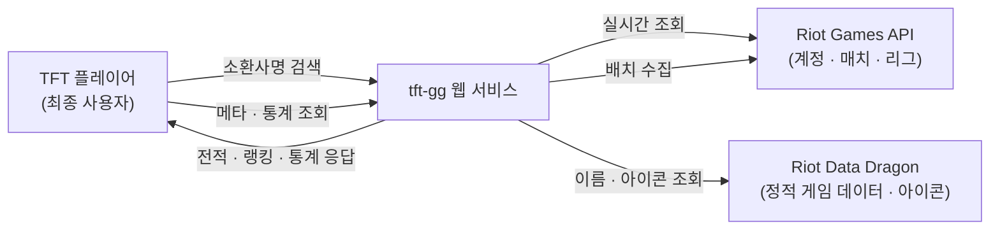

# Business Overview

## Business Context Diagram



### Text Alternative

```
TFT 플레이어 → (소환사명 검색 / 메타 조회) → tft-gg 웹 서비스
tft-gg 웹 서비스 → (실시간 조회, 배치 수집) → Riot Games API
tft-gg 웹 서비스 → (이름·아이콘 조회) → Riot Data Dragon
tft-gg 웹 서비스 → (전적·랭킹·통계 응답) → TFT 플레이어
```

## Business Description

- **Business Description**:
  롤토체스(Teamfight Tactics, TFT) 플레이어를 대상으로 하는 **전적 · 통계 · 메타 정보 웹 서비스**이다.
  op.gg / lolchess.gg 와 유사한 포지션으로, 플레이어가 자신의 전적을 조회하고 현재 메타에서
  어떤 조합 · 챔피언 · 아이템이 강한지 확인할 수 있게 한다.
  데이터 출처는 두 갈래다 — **실시간 Riot API**(전적검색 · 랭킹)와
  **자체 수집 후 전처리한 매치 데이터**(메타 통계 · 조합 티어리스트).

- **Business Transactions**:

  | # | 트랜잭션 | 설명 | 데이터 소스 | 현재 상태 |
  |---|----------|------|-------------|-----------|
  | BT-1 | 전적검색 | 소환사명#태그로 티어 · LP · 레벨 · 최근 10판 등수/조합 조회 | 라이브 Riot API | 동작 (유효한 API 키 필요) |
  | BT-2 | 서버 랭킹 조회 | 챌린저/그마/마스터 리그를 LP 내림차순으로 페이지 단위 조회 | 라이브 Riot API | 동작 (유효한 API 키 필요) |
  | BT-3 | 메타 통계 조회 | 분석 게임 수 · 표본 수 · 메타 조합 수 · 평균 유닛 수 · TOP 조합 | 전처리 CSV | **데이터 없음** (CSV 미생성) |
  | BT-4 | 조합 티어리스트 조회 | 대표 특성 2개로 묶은 조합의 티어 · 평균등수 · 픽률 · 핵심 유닛 | 전처리 CSV | **데이터 없음** (CSV 미생성) |
  | BT-5 | 챔피언 목록 조회 | 현재 세트 챔피언의 id · 이름 · 비용 | DDragon 로컬 미러 | **데이터 없음** (미러 미설치) |
  | BT-6 | 아이템 목록 조회 | 조합 아이템의 id · 이름 | DDragon 로컬 미러 | **데이터 없음** (미러 미설치) |
  | BT-7 | 매치 데이터 수집 · 전처리 | 상위티어 유저 → 최근 매치 → 상세 수집 → 참가자 단위 CSV 2종 생성 | 라이브 Riot API (배치) | 코드 완성, 미실행 |
  | BT-8 | 결투장(더블업) 소개 | 모드 개요 · 규칙 정적 안내 | 프론트엔드 하드코딩 | 동작 |

- **Business Dictionary**:

  | 용어 | 의미 |
  |------|------|
  | 롤토체스 / TFT | Teamfight Tactics. 라이엇의 오토배틀러 게임 |
  | 전적검색 | 특정 소환사의 티어와 최근 매치 결과를 조회하는 기능 |
  | 소환사명#태그 (Riot ID) | 라이엇 계정 식별자. 예 `hide on bush#KR1` |
  | puuid | 라이엇의 계정 전역 고유 식별자. 모든 API 조회의 키 |
  | 등수 (placement) | 한 판에서의 순위 1~8. **낮을수록 좋다** |
  | Top4 | 등수 4위 이내. TFT에서 사실상 '승리' 취급 |
  | 조합 (Comp) | 한 판에서 플레이어가 구성한 유닛 + 특성 세트. 본 서비스는 **활성 특성 중 유닛 수 상위 2개**를 조합 이름으로 사용 |
  | 특성 (Trait) | 유닛이 가진 시너지 속성. 일정 인원 이상 모이면 발동 |
  | 증강체 (Augment) | 게임 중 선택하는 강화 효과. **현재 Set 17 매치 데이터에는 필드가 없음** |
  | 조합 티어 (S/A/B/C/D) | 평균 등수 기준 등급. S: <4.0, A: <4.3, B: <4.6, C: <5.0, D: 그 이상 |
  | 픽률 (playRate) | 전체 참가자 표본 중 해당 조합이 등장한 비율 |
  | 더블업 / 결투장 | 2인 협동 모드 (queue 1150/1160). 전처리 파이프라인에서는 기본 제외 |
  | 랭크 게임 | queue 1100. 파이프라인 수집·전처리의 기본 대상 |
  | Apex 티어 | 챌린저 · 그랜드마스터 · 마스터. 세부 단계(I~IV)가 없다 |
  | DDragon | Riot Data Dragon. 챔피언/아이템/특성의 이름·아이콘을 제공하는 정적 데이터 CDN |
  | 목(mock) 모드 | 백엔드 없이 `src/mocks/` 의 더미 데이터로 UI를 구동하는 프론트엔드 모드 |

## Component Level Business Descriptions

### frontend (React SPA)
- **Purpose**: 플레이어가 실제로 마주하는 화면 전부. 8개 탭 네비게이션과 12개 라우트를 제공한다.
- **Responsibilities**: 라우팅, 디자인 시스템(op.gg 풍 모던 다크 그레이 + 블루 포인트),
  Loading/Empty/Error 상태 표준화, 백엔드 API 소비 및 목 데이터 폴백.
- **주의**: PRD v0.2 §3 은 "딥 틸 + 골드" LoL 테마를 정의하나, 2026-07-25 UI 개편으로
  op.gg / lolchess.gg 참고 테마로 **전면 교체**되었다 (`docs/260725_UI_개편_설명서.md`).
  PRD 의 디자인 섹션은 현재 구현과 일치하지 않는다.

### backend (FastAPI)
- **Purpose**: 프론트엔드가 기대하는 형태 그대로 JSON을 돌려주는 API 서버.
- **Responsibilities**: 라이브 Riot API 프록시(전적검색·랭킹, TTL 캐시 + 레이트리밋 대응),
  전처리 CSV 기반 통계·조합 계산, DDragon 로컬 미러 기반 챔피언·아이템 목록 제공.

### pipeline (배치 수집 · 전처리)
- **Purpose**: 메타 통계의 원천 데이터를 만든다. 모델 학습은 하지 않고 전처리까지가 범위.
- **Responsibilities**: 상위 티어 유저 목록 → 최근 매치 ID → 매치 상세 수집(JSONL),
  DDragon으로 ID→한글 이름 디코딩, 참가자 단위 평탄화, 유닛/특성 멀티핫 인코딩하여 CSV 2종 생성.

### ml (미구현)
- **Purpose**: 루트 README 기준 조합 클러스터링(scikit-learn) 담당 예정.
- **Responsibilities**: 현재 `clustering/`, `stats/` 디렉토리에 `.gitkeep` 만 존재. **코드 없음.**

### docs
- **Purpose**: 프론트엔드 기획 · 작업 이력 문서 보관.
- **Responsibilities**:
  - `PRD.md` (v0.2, 2026-07-12) — 화면 구조 · 디자인 토큰 · 라우팅 · API 소비 계약 · 릴리스 마일스톤(F1~F5)
  - `260725_UI_개편_설명서.md` (2026-07-25) — op.gg / lolchess.gg 참고 테마 개편 및 HomePage 신설 기록.
    PRD §3(컬러) 과 §9-2(홈 리다이렉트) 결정을 **의도적으로 뒤집은** 근거 문서
