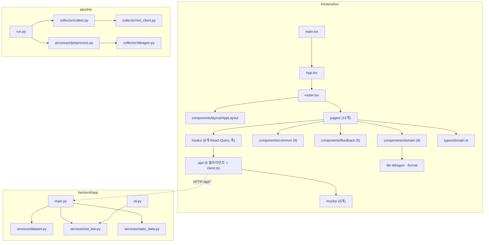

# Code Structure

## Build System

| 패키지 | 빌드 시스템 | 주요 설정 파일 |
|--------|-------------|----------------|
| frontend | npm + Vite 6 | `package.json`, `vite.config.ts`, `tsconfig.{json,app.json,node.json}`, `tailwind.config.js`, `postcss.config.js` |
| backend | pip (requirements.txt) | `backend/requirements.txt` |
| pipeline | pip (requirements 없음 — 루트/백엔드 환경 공유) | 없음 |
| ml | 없음 | 없음 |

- **frontend 스크립트**: `dev`(vite) / `build`(tsc -b && vite build) / `typecheck` / `preview` / `test`(vitest run)
- **경로 별칭**: `@/` → `frontend/src/` (`vite.config.ts` + `tsconfig.app.json`)
- **백엔드 실행**: `backend/` 에서 `uvicorn app.main:app --reload --port 8000`
- **파이프라인 실행**: 루트에서 `python -m pipeline.run [--players N --matches N --skip-collect --tiers ... --all-queues]`

## Module Hierarchy



### Text Alternative

```
frontend/src: main.tsx → App.tsx → router.tsx → AppLayout + pages/
              pages/ → hooks/ → api/ → (mocks/ 또는 HTTP)
              pages/ → components/{common,feedback,domain} → lib/
backend/app:  main.py → services/{dataset,riot_live,static_data}.py
              cli.py → services/riot_live.py
pipeline:     run.py → collector/collect.py → collector/riot_client.py
                     → processor/preprocess.py → collector/ddragon.py
```

## Existing Files Inventory

브라운필드 수정 후보 파일 전체 목록.

### frontend/src — 애플리케이션 진입
- `main.tsx` (10줄) — React 루트 마운트
- `App.tsx` (12줄) — QueryClientProvider + RouterProvider
- `router.tsx` (35줄) — createBrowserRouter, 12개 라우트를 AppLayout 하위에 등록
- `index.css` (59줄) — Tailwind 지시자 + 전역 스타일
- `vite-env.d.ts` (11줄) — `import.meta.env` 타입 선언

### frontend/src/pages — 12개 페이지
- `HomePage.tsx` (156줄) — 히어로 검색 + 추천 메타 + 랭킹 TOP 10. **가장 큰 페이지**
- `SearchPage.tsx` (44줄) — 지역 드롭다운 + 소환사명 입력 → `/summoner/:region/:name` 이동
- `SummonerPage.tsx` (106줄) — 프로필 헤더 + 최근 매치 리스트
- `StatisticsPage.tsx` (117줄) — 요약 카드 4개 + 증강체 TOP5 + 메타 조합 TOP5. 패치/티어 Dropdown
- `ItemsPage.tsx` (107줄) — 아이템 그리드 + 분류 탭 + 상세 Modal
- `ChampionsPage.tsx` (85줄) — 챔피언 그리드 + 비용/특성 필터
- `ChampionDetailPage.tsx` (74줄) — 프로필 카드 + **"상세 통계 준비 중" EmptyState (F5 예정)**
- `LeaderboardPage.tsx` (117줄) — 랭킹 Table + 지역 탭 + 티어 필터 + Pagination
- `CompsPage.tsx` (70줄) — 조합 카드 리스트 + 티어 필터
- `CompDetailPage.tsx` (69줄) — 조합 요약 + **"운영 가이드 준비 중" EmptyState (F5 예정)**
- `ArenaPage.tsx` (66줄) — 더블업 소개 정적 페이지. 규칙 4개 하드코딩 + 스크린샷 플레이스홀더 3개
- `NotFoundPage.tsx` (17줄) — 404

### frontend/src/components
**layout (5)**: `AppLayout`(18) · `NavBar`(90) · `Footer`(20) · `PageHeader`(21) · `Container`(6)
**common (9)**: `Table`(91) · `SearchBar`(90) · `Dropdown`(71) · `Modal`(51) · `Pagination`(46) · `Tabs`(44) · `Button`(42) · `Card`(33) · `Badge`(33)
**feedback (5)**: `QueryBoundary`(32) · `Skeleton`(33) · `ErrorState`(26) · `EmptyState`(24) · `Spinner`(12)
**domain (9)**: `AugmentIcon`(43) · `IconImage`(42) · `UnitList`(40) · `TierBadge`(37) · `MatchRow`(37) · `ItemIcon`(35) · `ChampionCard`(44) · `CompCard`(28) · `TraitIcon`(18)

### frontend/src — 데이터 계층
- `types/domain.ts` (114줄) — **API 소비 계약의 단일 원천**. 백엔드 응답 형태를 여기서 정의
- `api/client.ts` (20줄) — axios 인스턴스 + `USE_MOCK` 판정 + `withMockDelay`
- `api/{summoner,leaderboard,statistics,champions,items,comps}.ts` (9~20줄) — 엔드포인트별 클라이언트. 각각 `USE_MOCK` 분기로 목/실 전환
- `hooks/use{Summoner,Leaderboard,Statistics,Champions,Items,Comps}.ts` (9~10줄) — React Query 래퍼
- `mocks/{summoner,leaderboard,statistics,champions,items,comps}.ts` (21~80줄) — 목 데이터
- `lib/queryClient.ts`(11) · `lib/ddragon.ts`(23) · `lib/format.ts`(24)
- `config/nav.ts`(17) — 8개 탭 정의 · `config/regions.ts`(12) — 지역 목록
- `theme/tokens.css` (24줄) — 디자인 토큰 CSS 변수

### backend/app
- `main.py` (89줄) — FastAPI 앱, CORS, 6개 엔드포인트 + 헬스체크
- `services/riot_live.py` (416줄) — **백엔드 최대 모듈**. 라이브 Riot 연동 일체
- `services/dataset.py` (160줄) — 전처리 CSV → 통계/조합 계산
- `services/static_data.py` (62줄) — DDragon 미러 → 챔피언/아이템
- `cli.py` — 프로토타입 CLI 재현

### pipeline
- `run.py` (1917B) — argparse 진입점, 수집 → 전처리 오케스트레이션
- `collector/riot_client.py` — Riot API 클라이언트 (레이트리밋 · 429 재시도)
- `collector/ddragon.py` — DDragon 로더, ID→한글 디코더 (로컬 미러 우선 → CDN 폴백)
- `collector/collect.py` — 상위티어 유저 → 매치 수집 → JSONL
- `processor/preprocess.py` (128줄) — 평탄화 · 디코딩 · 멀티핫 인코딩 → CSV 2종

### 기타
- `docs/PRD.md` (223줄) — 프론트엔드 PRD v0.2 (2026-07-12). **§3 디자인·§9-2 홈 결정은 현재 구현과 불일치**
- `docs/260725_UI_개편_설명서.md` (131줄) — op.gg/lolchess 참고 테마 개편 기록. 색 토큰 재매핑 전략과 잔여 TODO 4건 포함
- `docker-compose.yml` — **0바이트 빈 파일**
- `ml/{clustering,stats}/.gitkeep` — **빈 스캐폴딩**
- `frontend/dist/` — **빌드 산출물이 git 에 커밋되어 있다** (`index.html` + 해시 파일명 JS/CSS).
  소스 변경 없이 dist 만 갱신되는 커밋이 존재해 소스-빌드 동기화 여부를 신뢰하기 어렵다

## Design Patterns

### Mock Fallback (프론트엔드)
- **Location**: `api/client.ts` 의 `USE_MOCK` + 각 `api/*.ts`
- **Purpose**: 백엔드 없이 UI 를 선행 개발. PRD §7 의 명시적 설계 결정
- **Implementation**: `VITE_API_BASE_URL` 미설정 또는 `VITE_USE_MOCK=true` 이면 `mocks/` 반환.
  `withMockDelay(450ms)` 로 스켈레톤 확인 가능. 컴포넌트 변경 없이 실 API 전환

### Query Boundary (프론트엔드)
- **Location**: `components/feedback/QueryBoundary.tsx`
- **Purpose**: `isLoading` → Skeleton, `isError` → ErrorState, `isEmpty` → EmptyState 분기를 한 곳으로
- **Implementation**: 모든 페이지가 동일 패턴으로 감싸 상태 처리 일관성 확보

### Service Layer 분리 (백엔드)
- **Location**: `main.py` 는 라우팅만, 로직은 `services/` 3개 모듈
- **Purpose**: 데이터 소스(라이브 API / 전처리 CSV / 정적 미러)별 관심사 분리

### Graceful Degradation (백엔드)
- **Location**: `dataset.py` 의 `has_data()`, `static_data.py` 의 `_load()`
- **Purpose**: 데이터 파일이 없어도 500 대신 빈 응답/플레이스홀더를 반환해 프론트가 EmptyState 를 그리게 함

### TTL 캐시 + 병렬 페치 (백엔드)
- **Location**: `riot_live.py` 의 `_cached()`, `ThreadPoolExecutor(max_workers=5)`
- **Purpose**: 개발용 Riot 키의 2분당 100회 제한 회피 및 응답 지연 단축

### 조합 시그니처 (백엔드, 공통 규칙)
- **Location**: `dataset.py::_compute_comps` 와 `riot_live.py::_comp_name`
- **Purpose**: '활성 특성 중 유닛 수 상위 2개'로 조합을 식별. 오프라인/라이브 양쪽에서 동일 규칙 사용
- **주의**: 같은 규칙이 **두 곳에 중복 구현**되어 있다 (변경 시 동기화 필요)

## Anti-patterns / 구조적 부채

- **조합 명명 규칙 중복**: `dataset.py` 와 `riot_live.py` 에 각각 구현
- **`riot_live.py` 비대화**: 416줄에 라우팅 상수 · HTTP · 캐시 · 도메인 변환 · 응답 조립이 모두 혼재
- **모듈 수준 전역 가변 상태**: `_ddragon_version`, `_trait_names`, `_cache` 가 전역. 락은 `_cache` 에만 존재
- **`lru_cache` 로 인한 데이터 갱신 불가**: `dataset.py` 는 CSV 를 최초 1회만 읽는다. 파이프라인이 CSV 를 갱신해도 **서버 재시작 전까지 반영되지 않는다** (모듈 docstring 의 "서버 재시작 불필요" 주석과 모순)
- **하드코딩된 값**: `StatisticsPage` 패치 목록(14.11~14.13), `static_data.py` 의 `TFT17_` 접두사

## Critical Dependencies

### React 18.3.1 + React Router 6.28
- **Usage**: SPA 전반. `createBrowserRouter` 사용
- **Purpose**: PRD §2 지정

### TanStack Query 5.62
- **Usage**: `hooks/*` 6개 훅 전부
- **Purpose**: 서버 상태 캐싱 및 로딩/에러 상태 표준화

### Tailwind CSS 3.4 + 커스텀 토큰
- **Usage**: 전 컴포넌트. `tailwind.config.js` 에 `brand` · `gold` · `teal` · `bg-*` · `tier-*` · `rank-*` · `cost-*` 토큰 정의
- **Purpose**: 디자인 시스템. **토큰 값만 교체해 전체 앱을 리스킨하는 전략**을 실제로 사용했다
  (2026-07-25 개편 시 33개 파일을 건드리지 않고 config 의 색 값만 변경)
- **⚠️ 함정**: 그 리스킨 결과 **`gold` 토큰의 실제 값이 파란색(`#5383E8`)** 이다.
  동일 값의 `brand` 토큰이 새로 추가되었으나 기존 사용처는 아직 `gold` 를 쓴다.
  신규 코드는 `brand` 를 써야 한다 (`docs/260725_UI_개편_설명서.md` §5)

### axios 1.7
- **Usage**: `api/client.ts` 단일 인스턴스 (baseURL, timeout 10초)

### FastAPI + uvicorn
- **Usage**: `backend/app/main.py`

### pandas
- **Usage**: `backend/services/dataset.py`, `pipeline/processor/preprocess.py`
- **⚠️ 문제**: `backend/requirements.txt` 에 **pandas 가 빠져 있다**. 해당 requirements 만으로 설치하면 `/api/statistics` · `/api/comps` 호출 시 `ImportError` 로 실패한다

### requests + python-dotenv
- **Usage**: `riot_live.py`, `pipeline/collector/riot_client.py`
