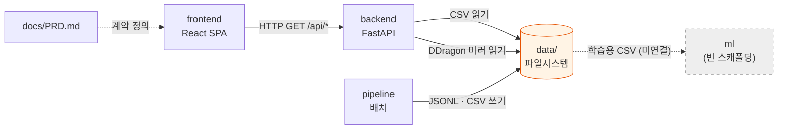

# Dependencies

## Internal Dependencies



### Text Alternative

```
frontend  --HTTP--> backend
backend   --read-->  data/processed/*.csv, data/TFT_DDragon/
pipeline  --write--> data/raw/*.jsonl, data/processed/*.csv
docs/PRD.md --정의--> frontend (API 소비 계약)
data --(미연결)--> ml
```

### frontend depends on backend
- **Type**: Runtime (HTTP)
- **Reason**: 6개 GET 엔드포인트 소비. 단, `USE_MOCK` 폴백이 있어 **빌드·기동 시점 의존성은 아니다**
- **결합 지점**: `frontend/src/types/domain.ts` 의 타입 정의. 백엔드에 대응 스키마가 없어 **컴파일 타임에 강제되지 않는 암묵적 계약**

### backend depends on data/
- **Type**: Runtime (파일시스템)
- **Reason**: `dataset.py` → `data/processed/tft_participants.csv`,
  `static_data.py` → `data/TFT_DDragon/data/ko_KR/{champion,item}.json`,
  `riot_live.py` → `data/TFT_DDragon/data/ko_KR/trait.json` (없으면 CDN 폴백)
- **현재 상태**: `data/` **디렉토리 자체가 없음** → 4개 엔드포인트가 빈 응답

### pipeline produces data/
- **Type**: Runtime (파일시스템, 배치)
- **Reason**: `collect.py` → `data/raw/tft_matches.jsonl`,
  `preprocess.py` → `data/processed/{tft_participants,tft_features}.csv`
- **주의**: backend 와 pipeline 사이에 **코드 의존은 없다.** 오직 파일 경로 규약으로만 연결된다.
  경로가 각자 하드코딩되어 있어 한쪽을 옮기면 조용히 깨진다

### ml depends on (nothing)
- **Type**: 없음
- **Reason**: 코드 자체가 없다. `tft_features.csv` 를 쓸 의도로 보이나 연결된 코드 없음

### 중복 구현 (의존이 아닌 복제)
| 기능 | 위치 1 | 위치 2 |
|------|--------|--------|
| DDragon ID→이름 디코딩 | `pipeline/collector/ddragon.py` (`DDragon` 클래스) | `backend/services/riot_live.py::_trait_name_map()` |
| 조합 시그니처 (상위 2개 특성) | `backend/services/dataset.py::_compute_comps` | `backend/services/riot_live.py::_comp_name` |
| DDragon 버전 관리 | `frontend/.env` 의 `VITE_DDRAGON_VERSION` | `riot_live.py::ddragon_version()` (env `DDRAGON_VERSION` → CDN 조회 → 상수 폴백) |

## External Dependencies

### frontend — dependencies (프로덕션)

| 패키지 | 버전 | 목적 | 라이선스 |
|--------|------|------|----------|
| react | ^18.3.1 | UI 프레임워크 | MIT |
| react-dom | ^18.3.1 | DOM 렌더러 | MIT |
| react-router-dom | ^6.28.0 | SPA 라우팅 | MIT |
| @tanstack/react-query | ^5.62.0 | 서버 상태 관리 | MIT |
| axios | ^1.7.9 | HTTP 클라이언트 | MIT |

### frontend — devDependencies

| 패키지 | 버전 | 목적 | 라이선스 |
|--------|------|------|----------|
| typescript | ^5.7.2 | 타입 검사 | Apache-2.0 |
| vite | ^6.0.5 | 빌드 · dev 서버 | MIT |
| @vitejs/plugin-react | ^4.3.4 | React Fast Refresh | MIT |
| tailwindcss | ^3.4.17 | CSS 프레임워크 | MIT |
| postcss | ^8.4.49 | CSS 변환 | MIT |
| autoprefixer | ^10.4.20 | 벤더 프리픽스 | MIT |
| vitest | ^3.2.4 | 테스트 러너 | MIT |
| jsdom | ^25.0.1 | 브라우저 환경 | MIT |
| @testing-library/react | ^16.1.0 | 컴포넌트 테스트 | MIT |
| @testing-library/jest-dom | ^6.6.3 | DOM 매처 | MIT |
| @types/node, @types/react, @types/react-dom | - | 타입 정의 | MIT |

### backend — requirements.txt

| 패키지 | 버전 | 목적 | 라이선스 |
|--------|------|------|----------|
| requests | **미고정** | Riot API HTTP 호출 | Apache-2.0 |
| python-dotenv | **미고정** | `.env` 로드 | BSD-3 |
| fastapi | **미고정** | REST API 프레임워크 | MIT |
| uvicorn | **미고정** | ASGI 서버 | BSD-3 |

### pipeline — requirements 파일 없음

암묵적으로 필요한 패키지:

| 패키지 | 사용처 | 선언 여부 |
|--------|--------|-----------|
| requests | `collector/riot_client.py`, `collector/ddragon.py` | backend 것을 공유 (pipeline 자체 선언 없음) |
| pandas | `processor/preprocess.py` | **어디에도 없음** |
| python-dotenv | Riot 키 로드 | backend 것을 공유 |

## 의존성 리스크

| # | 리스크 | 영향 | 심각도 |
|---|--------|------|--------|
| D-1 | **pandas 미선언** — `backend/requirements.txt` 에 없음 | 깨끗한 환경에서 requirements 설치 후 `/api/statistics`·`/api/comps` 호출 시 `ImportError` 로 500. `python -m pipeline.run` 도 실패 | 높음 |
| D-2 | **Python 의존성 버전 전부 미고정** | 재현 가능한 빌드 불가. FastAPI/uvicorn 메이저 업데이트 시 조용히 깨질 수 있음 | 중간 |
| D-3 | **pipeline 전용 requirements 부재** | 파이프라인만 독립 실행하는 환경 구성 방법이 문서화되지 않음 | 중간 |
| D-4 | **Riot 개발용 키 24시간 만료** | 전적검색·랭킹이 매일 401 로 죽는다. 운영 배포 시 프로덕션 키 필수 | 높음 (운영 기준) |
| D-5 | **DDragon 로컬 미러가 수동 git clone 의존** | 자동화된 설치 절차 없음. 미설치 시 챔피언·아이템 API 가 조용히 빈 배열 반환 | 중간 |
| D-6 | **DDragon 버전 3중 관리** | 프론트 아이콘과 백엔드 이름 데이터가 서로 다른 세트를 참조할 수 있음 | 중간 |
| D-7 | **data/ 경로 하드코딩 (backend·pipeline 양쪽)** | 한쪽 이동 시 조용한 실패(빈 응답) | 낮음 |
| D-8 | **CORS `allow_origins=["*"]`** | 개발용으로는 무해하나 운영 배포 시 제한 필요 | 낮음 (현 시점) |
